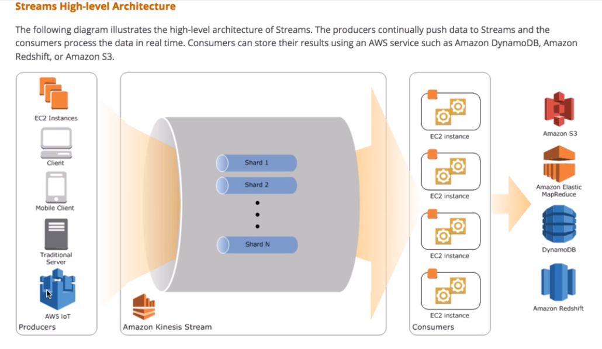
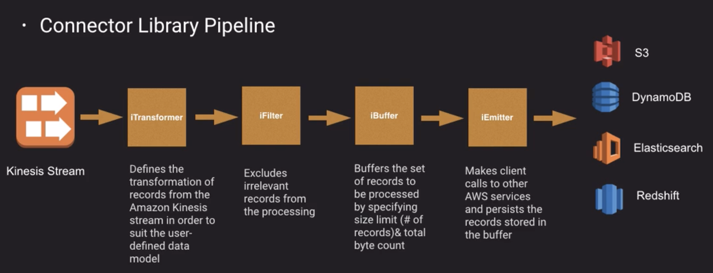
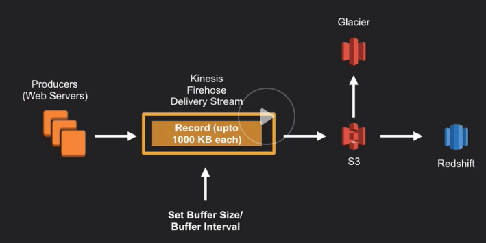

## General Overview of Amazon Kinesis Streams

* **Collect and process large streams of data in real time**
* Create data-processing applications
  * Read from streams
  * Process records
    * Send to a dashboard
    * Generate alerts
    * Take decisitions according to data etc..
* The typical scenarios for Kinesis streams could be:
  * Fast logs and data feed intake and processing
  * Real time metrics and reporting
  * Reak time data analytics
  * Complex stream processing
* The benefits of Kinesis are:
  * Real time aggregation of data
  * Loading data into a data warehouse or map reducer cluster
  * Durability and Elasticity
  * Parallel application readers
* In order to load or get data from Kinesis streams we have several options:
  * Kinesis producer Library (KPL)
  * Kinesis client Library (KCL)
  * Kinsesis Agent (To send and collect data)
  * Kinesis Rest API 

## Kinesis Core Concepts

* Shards

  * A shard is a uniquely identified group of data records in a stream
  * A shard has 1MB/sec of data input and 2MB/s of data output
  * It allows 5 transactions for sec for reads 
  * it supports 1000 records write per second
  * You can create multiple shards in a stream so you can increase your stream capacity I/O adding more shards to your stream
  * With resharding you can dynamically modify the shards associated with your stream Split shards to increase capacity or merge shards to reduce the capacity

* Records

  * The record is the unit of data of a Stream. 
  * It is composed of:
    * Partition Key:
      * Group data by shards
      * Tells you which shard the data belongs to
      * The partition key is specified by the application that puts the data into the stream.
    * Sequence number:
      * Unique identifier for records inserted into a shard
      * Unique key that identify a data blob
      * Assigned when a producer calls PutRecord or PutRecords operation
      * You can't use sequence numbers to logically separate data in terms of what shards they come from. You should use the partition key
    * Data Blob
      * Is the actual data that the producer adds to a stream
      * The maximum size of a data blob is 1 MB

* Retention Period

  * 24 hours default
  * it can be changed until 7 days

* Data producer (Amazon Kinesis API)

  * AWS SDK for Java
  * PutRecord - single
  * PutRecords - multiple

* Data Producer (Kinesis Producer Library - KPL)

  * Configurable library to create producer applications that allow developers to achieve high write thought put to a Kinesis Stream.
  * Write to one or more kinesis streams with auto-retry configurable options
  * Collects records to write multiple records to multiple shards per request
  * Aggregate user records
  * Kinesis Client Library Integration
  * Monitoring with Cloudwatch
  * do not use KPL if your producer application can not incur in an additional processing delay
  * RecordMaxBufferedTime can be used to avoid this issue with KPL with a large value better performance but delay records, low values negative impact in throughtput inside the stream. 
  *  Aggregation: Allows you to combine multiple user records into a single Stream record, helping improve per shard throughtput
  * Collections: Multiple streams are batched and sent in a single HTTP request with a call to the PutRecords, it allows to increas the throughtput because we are not doing additional HTTP requests.
  * So collections groups streams to reduce HTTP calls and aggregation combine multiple records into a single Stream record in order to efficiently use shards
  * putRecords doesn't stop if one put fails and it returns 200 status. 
  * The putRecords result method in the KPL can be used to detect individual failures and retry the PUT based on the HTTP status code. 
  * Additional resource about KPL [Implementing efficient and reliable producers with the Amazon kinesis producer library](https://aws.amazon.com/blogs/big-data/implementing-efficient-and-reliable-producers-with-the-amazon-kinesis-producer-library/)

* Data Producer (Amazon Kinesis Agent)

  * It's a standard java application that can be installed
  * It can monitor multiple directories and write to multiple streams 
  * Pre process data
    * Multi-line record to single line
    * convert from delimiter to Json
    * convert a record from log format to json

* Data Consumers

  * a stream can be consumed using the kinesis client library

  * consume and process data using KCL

  * it manage load balancing resharding etc...

  * you can use Java, Node.js, python or ruby.

  * The KCL has a checkpoint to check with record has been processed

  * Run your consume application running ot on EC2 with autoscaling group in order to replace failed instances or handle additional load

  * Automatically load balances record processing accross many instances

  * Supports de-aggregation of recrods that were aggregated with KPL

  * For each KCL instace it uses a unique DynamoDB table to track the application state so the application name of KCL should be unique

  * Each row in that table represents a shard and the hash key for that table is the shard ID

  * The dynamo DB has a write/read capacity of 10 units so it could appears problems of thought puts if you have so many shards of you have frequent checkpointing. To solve this it is recommended to add additional thoughtput capacity to your dynamoDb table

  * For the exam!! 

    * Kinesis is suitable for any kind of scenario where you are streaming a large amount of data that needs to be processed quickly and you have a requirement to build a custom application to process and analyse streaming data

    * What is a shard

    * Retention Period

    * Data Producers

    * Data consumers

    * Additional thoughtput for DynamoDb application state table if you get provisiones thoughtput exception errors

      

## Emiting Data to other AWS services

* Consumer can emmit data to S3, DynamoDb, ElasticSearch RedShift, EMR or Lambda

*  Use Cases

  * S3 Archiving Data
  * DynamoDb metrics
  * ElasticSearch for search and index
  * RedShift micro batch loading
  * EMR to process and analyze data
  * Lambda Automate emmiting data to S3, DynamoDb or RedShift

* Kinesis Connector Library

  * JAva based

  * Used with Kinesis Consume Client

  * Emit data to DynamoDb, ElasticSearch, RedShift and S3

    

  

## Amazon Kinesis Firehose

* Collects and loads streaming data near in real-time

* Load data into S3, Redshift and ElascticSearch

* Use existing Business Intelligence applications and dashboards to visualizate the data

* Highly available and durable

* Fully managed:

  * Scalability, sharding and monitoring with zero administration
  * minimaze storage
  * secure

* It can be managed with console or API

* For a Kinesis Firehose you have a BufferSize(1Mb-128MB)/BufferInterval(60-900sec) and the first condition satisfied will move data into the desired service (S3, Redshift or ElasticSearch)

  

* In order to load data into Kinesis Firehose there are several methods:

  * Kinesis Agent
    * Send Data to Firehose Delivery Stream
    * CloudWatch metrics
    * Preprocess Data
      - Multi line record to single line record
      - convert to Json
      - convert from log format into Json
  * AWS SDK
    * Java, .Net, Node.js, Python or Ruby
    * PutRecord - single record
    * PutRecordBatch - multiple records

* Kinesis Firehose allows to Invoke a Lambda function to transform data

* Data transformation flow

  * Buffer incoming data up to 3MB
  * Firehose invoke lambda function to transform data
  * Lambda returns transformed data
  * Transformed data is deliverid to destination service

* Parameters for transformation

  * recordId - The transformed record must have the same recordId prior transformation
  * Result could be one of these:
    * Ok
    * Dropped: Intentional ignored by lambda logic
    * ProcessingFailed: failed to process
  * Data: Base 64 encoded transformed record data

* There are several lambdas blueprints for firehose transformations [Aws developer blog about firehose transformations using AWS lambda](https://aws.amazon.com/blogs/compute/amazon-kinesis-firehose-data-transformation-with-aws-lambda/)

* Failure handling

  * 3 tries default
  * invocation erros can be logged using cloudwatch
  * Unsuccessfully process records are sent directly to S3 bucket in the processing_failed folder

* Data Delivery

  * S3
    * Depends on buffer size and buffer interval
    * Firehouse can raise the buffer size dynamically
  * RedShift
    * How fast can the Redshift cluster finish the Copy command
    * Firehose issues new Copy command automatically
  * ElasticSearch
    * Depends on buffer size and buffer interval
    * Firehouse can raise the buffer size dinamically

* Failures

  * S3 - Retries delivery fo up to 24h
  * Redshift
    * Retry duration configurable between 0 and 7200sec from S3
    * Skip S3 objects
    * Manifest the manual backfill
  * ElasticSearch
    * Configurable retry duration 0-7200
    * Skip index request
    * Skipped documents sent to S3 in Json format
    * manual backfill