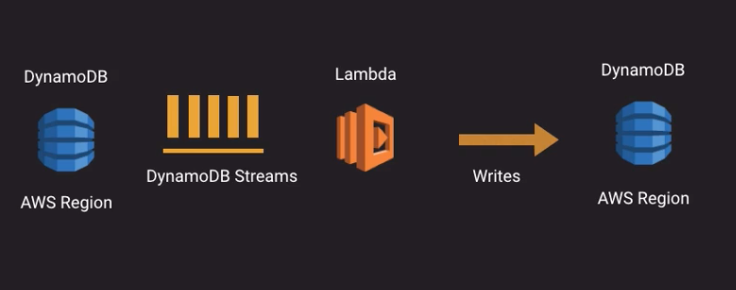
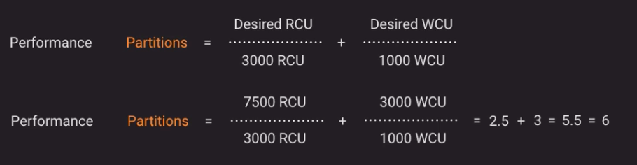
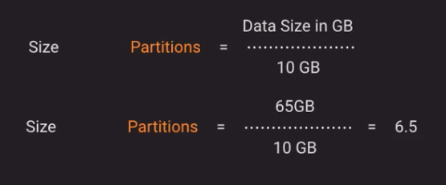

## Glacier

* Keep all your data at much lower cost
* compliance requirement to keep your data
* Vault lock
  * deploy and enforce control for a vault with a vault lock policy
  * Policies
    * locked from editing
    * policies cannot be changed after locking
    * enforce compliance controls
    * created using IAM
  * Lock process
    * attach a vault lock policy to your vault
    * the lock set inProgress state and a lock ID is returned
    * the lock needs to be validated in 24 hours
    * Complete vault lock from inProgress -> locked state

## Dynamo DB

* a fully managed NoSQL database service
* seamless scalability
* no visible servers
* no practical storage limitations
* SSD
* fuly resilient and highly available
* scales in a linear way
* integrated with IAM 
* Collection of tables

## DynamoDb Partitions

* A partition is the underlying storage and processing nodes of DynamoDb
* Initially one table equates to one partition
* You don't direcly cointrol de number of partitions
* A partition can store 10GB
* A partition can handle 3000 Read Capacity units (RCU) and 1000 Write Capacity units (WCU)
* there is a capacity and performance relationship to the number of partitions
* Design tables and applications to avoid IO "hot spots"/"hot keys"
* When data exceed the partition storage or WCU or RCU a new partition is created and the data is spread between them over time.
* How data is distributed?
  * Based on its partition key (HASH)
  * partitions will automatically increase
  * while there is and automatic split data across partitions there is no automatic decrease when load/performance reduces
  * allocated WCU and RCU is split between partitions
  * Each partition key is:
    * limited to 10GB
    * limited to 3000 RCU and 1000 WCU

## DynamoDb GSI/LSI

* Dynamo provide two different operations SCAN and QUERY. Scan is not optimus and expensive operation
* Without indexes, your hability to retrieve information is limited to your primary table structure
* Indexes allow secondary representations of the data in a table allowing efficient queries on those representation
* indexes comes in two forms global secondary and local secondary
* Local secondary index
  * It has to be created at the moment of the table creation
  * LSI contains partition key, sort and new sort key and also projected values
  * Any data written to the talbe is copied async to any LSI's
  * LSI's consumes RCU and WCU
  * LSI is a sparse index. And index will only have an ITEM if the index sort key attribute is contained in the table item (row)
  * Any no key value by default are not stored in a LSI
  * If you are querying and attribute which is not projected. you are charged for the entire ITEM cost from pulling from the main table
  * It is very important to design thinking in LSI and item projections
* Global Secondary index
  * it shares many of the concepts as LSI but with GSI we can have an alternative partition and short key
  * Options for attribute projection
    * KEYS_ONLY New partition key and sort keys, old partition key and if applicable old sort key
    * INCLUDE - Specify custom projection values
    * ALL - Include all attributes
  * The RCU and WCU are defined on the GSI in the same way as the table
  * Changes are written to the GSI asynchronously
  * GSI only support eventually consistent read

## DynamoDB Streams and Replication

* An order record of updates to a dynamoDB table

* When a stream is enabled on a table it records changes to a table and stores those values for 24 hours

* A stream can be enabled on a table from a console or API

* But can only be read or processed via streams endpoint and API requests

* AWS guarantee that each change in a DynamoDB table occur in the stream once and only once

* All changes to the table occur in the stram near real time

* the streams stores all partition keys for each operation

* Streams provides 4 different views

  * KEYS_ONLY only keys
  * NEW_IMAGE - it save the entire the new item
  * OLD_IMAGE - it save the entire item before update
  * NEW_AND_OLD_IMAGE it saves previous and update complete item

* Uses cases:

  * Replication
  * Triggers

* DynamoDB replication

  * https://docs.aws.amazon.com/amazondynamodb/latest/developerguide/Streams.CrossRegionRepl.html

  * other option to performs replication

    

## DynamoDb performance

* Partitions

  * there are two formulas one based on performance and other based on capacity

    

  * Based on size

    

* What makes a good key?

  * the attribute should have many distinct values
  * the attribute should have a uniform write pattern across all partition key values
  * the attribute should have a uniform temporal pattern across time
  * you shouldn't mix hot and cold key values within a table

* Global Secondary indexed performance and considerations

  * GSI have their own RCU and WCU values and use alternative keys
  * 

  

